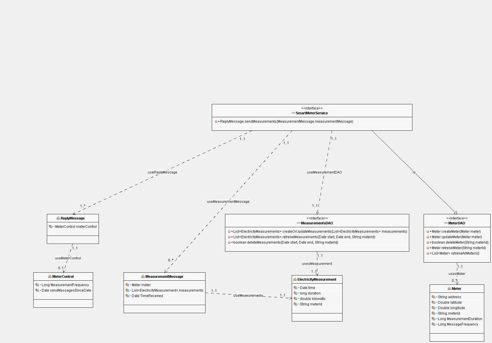
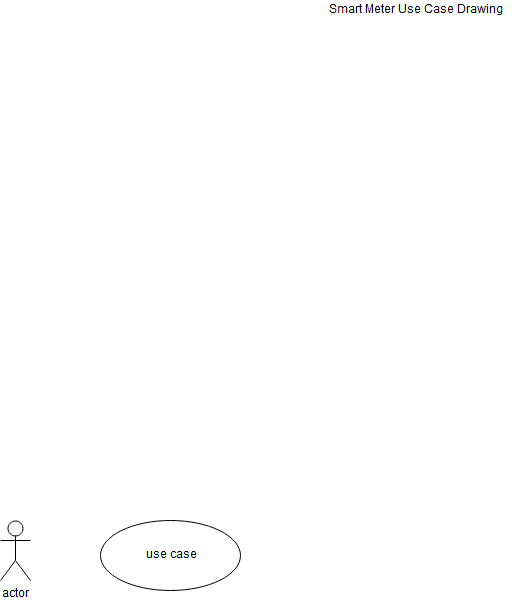
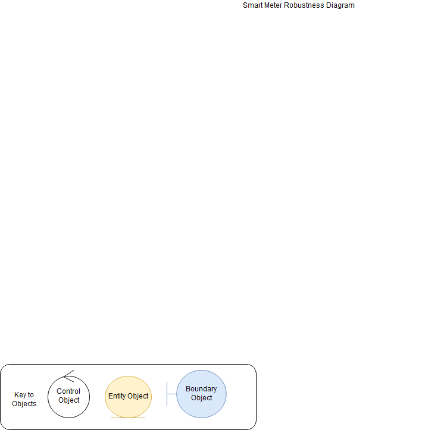

# Smart Meter System

Every home in the UK will be fitted with a smart meter which can measure electricity usage in Kilowatt Hours. 

## Smart Meters

Smart meters will each have a unique smart meterID, address, latitude and longitude.

A Kilowatt is a measure of how much power is being used at an instance of time. 

A Kilowatt Hour is a measure of how much power has been used during an hour. 

Electricity usage will be measured at intervals throughout the day so that electricity charging can be varied depending upon peak or off-peak usage.

The meters will measure average power consumption regularly many times per day with a 'measurementDuration' ( in ms) between each measurement.
The measurementDuration can be varied for each meter by the smart meter service. 
Usually this is set to every 15 minutes.

The Kilowatt Hours usage for each interval is calculated using the following formula 
```
Kwh = (Average Kilowatt consumption in duration) * duration (in ms) / 60000 ms
```
The smart meters will send measurements messages using a ReST interfaces to a cloud based smart meter service.
These messages will contain a list of measurements collected since the last message was sent.

Each smart meter will send messages to the smart meter service every 'messageDuration' interval. 

Usually the 'messageDuration' interval is set so that messages are sent once a day.
However on failure to communicate, messages will be retried until the message is sent successfully.

Because the smart meters will communicate from behind a firewall, they cannot be contacted directly.
The smart meters must always initiate communication to the cloud service from behind the firewall.
Thus any control messages sent by the cloud service to the smart meter (setting message duration or measurement interval) must be sent as a reply to a message received by the smart meter service.

## Smart Meter Cloud Service

Operators of the smart meter cloud service can create, retrieve, update or delete smart meters using a web interface (JSP)

Operators can also retrieve a list of measurements for a device between a start time and end time (Date)

Operators can retrieve an total count of kilowatt hours consumed by a meter between two dates.

(We will not worry about calculating charging in this exercise)

The smart meter cloud service will expose a ReST endpoint that can receive messages from the meters.

The service will only store data from known smart metersId's. 
It will log unknown Id's as a warning message.

The smart meter cloud service saves all measurements received from each known smart meter using a Measurements Data Access Object

## Exercise
1. Use the use case templates and UML diagram below to create a use case using draw.io (https://www.draw.io/)

2. Use the robustness diagram templates below to create a robustness diagram for the service including the smart meter

## Answers

[Answers are available here](../smartmeter-uml/ANSWER.md)

PLEASE DO NOT CHEAT YOURSELF by looking too soon at the answers

## Class Diagram




## Use Case Template



## Robustness Diagram Template


